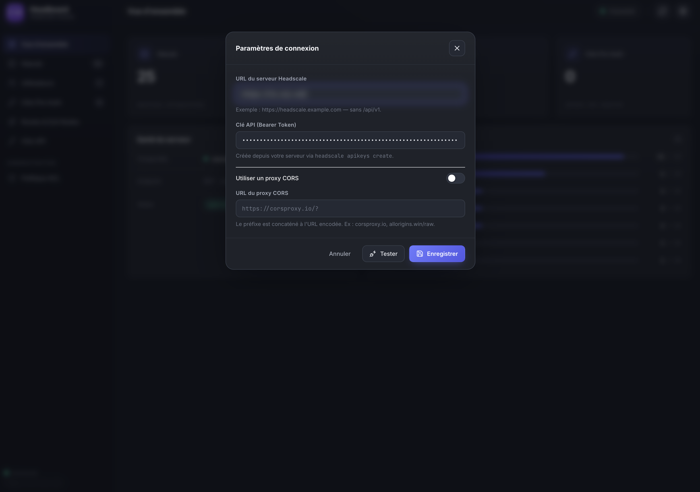
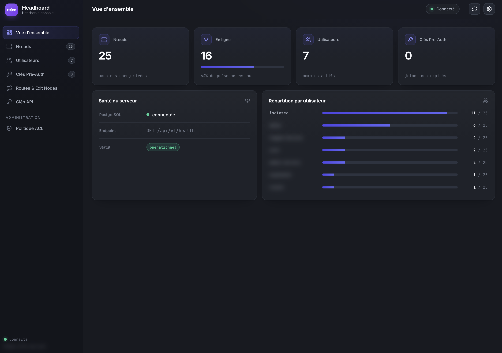
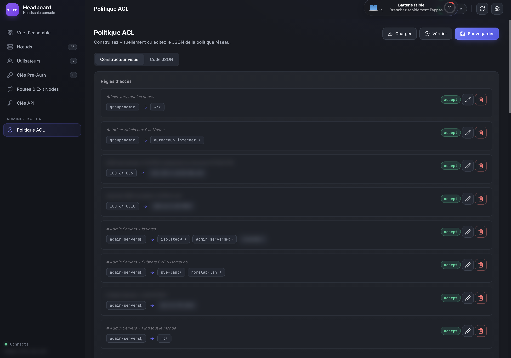
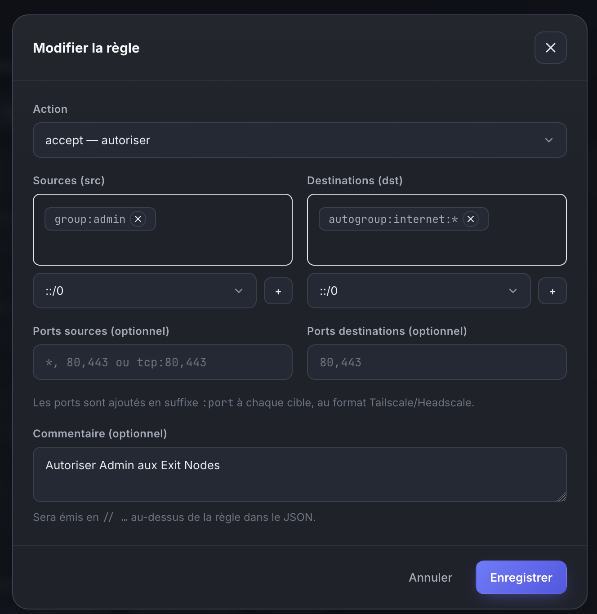
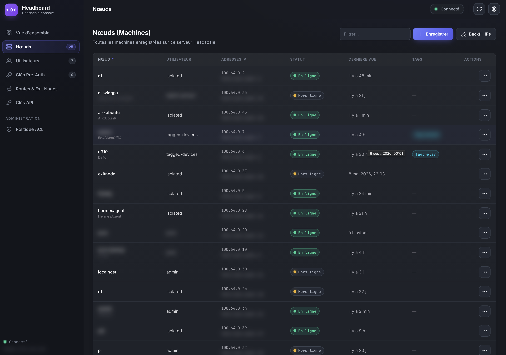

# Headboard

**Headboard** is a lightweight, build-free web admin console to manage a **Headscale** server. It lets you control nodes, users, pre-authentication keys, routes / exit nodes, API keys, and the **ACL policy** straight from the browser.

---

## ✨ Features

- **Overview** : server health, node distribution per user.
- **Nodes** : sortable list (name, user, IP, status, last seen), filtering, details, rename, expiration, route approval, tag management. Status *Online / Offline / Expired*.
- **Users** : create, rename, delete.
- **Pre-Auth Keys** : generation, expiration, ACL tags.
- **Routes & Exit Nodes** : approve / revoke announced routes.
- **API Keys** : create and revoke.
- **ACL Policy** : visual builder (rules, groups, hosts, tagOwners, autoApprovers) + raw JSON editing, with server-side save and validation.

Everything runs **client-side** : no framework, no build — a plain static site served by any HTTP server.

---

## 📦 Project structure

```
.
├── index.html        # Main page (interface)
├── js/
│   ├── app.js        # Entry point : state, rendering, events
│   ├── api.js        # Headscale REST API client
│   └── acl-builder.js# ACL policy parsing / generation
├── style.css         # Custom styles
└── README.md
```

---

## 🚀 Quick start

Two options : **static files** (simplest) or **Docker Compose**.

### Option A — Serve the static files

Just serve the source files with any HTTP server :

```bash
# e.g. with Python
python3 -m http.server 8080

# or with Node.js / npx
npx serve .
```

Then open `http://localhost:8080` in your browser.

### Option B — Docker Compose (recommended)

The `docker-compose.yml` is **not** shipped in the repository : it is given below — copy it into a `docker-compose.yml` file at the root of a folder that **contains the sources**.

> ⚠️ **Before launching** : you must obtain the project sources into the current folder (see [Getting the sources](#getting-the-sources)).

```yaml
services:
  headboard:
    image: nginx:alpine
    container_name: headboard
    ports:
      - "8080:80"
    volumes:
      - ./src:/usr/share/nginx/html:ro
    restart: unless-stopped
```

Then, at the root :

```bash
docker compose up -d
```

Open `http://localhost:8080`.

> **About the volume** : `./src:/usr/share/nginx/html` mounts the local `./src` folder (containing `index.html`, `js/`, `style.css`) into nginx's served directory. Any change in `./src` is reflected immediately in the container.

---

## 📥 Getting the sources

You must have the source files in a folder named **`./src`** (the Docker volume points to it). Two methods :

### Method 1 — Download the `.zip` from Releases (recommended)

1. Go to the **Releases** tab of the GitHub repository.
2. Download the latest `.zip`.
3. Extract it into a local `src/` folder :

```bash
mkdir -p src
unzip headboard-vX.Y.Z.zip -d src
```

### Method 2 — `git clone` into the current folder

From the folder that will contain `./src` (project root), clone the repository **into** `src` :

```bash
git clone https://github.com/xnjustx/headboard.git src
```

> ⚠️ With `git clone`, the sources land in `./src`. If you use the static option (Option A), serve **the contents** of `src/` (or serve the root if the sources sit directly at the root).

---

## 🔌 Headscale API configuration

On first launch, click the **Settings** icon (top right) and fill in :

- **Headscale server URL** — e.g. `https://headscale.example.com` (without `/api/v1`).

- **API key (Bearer Token)** — created server-side with :
  
  ```bash
  headscale apikeys create
  ```

- *(optional)* **CORS proxy** — if the Headscale server does not accept browser-originated calls, enable a CORS proxy (e.g. `https://corsproxy.io/?`).

The configuration is stored in the browser's `localStorage`.

---

## ⚙️ Prerequisites

| Method | Dependency                                           |
| ------ | ---------------------------------------------------- |
| Static | Python 3, Node.js, or any HTTP server                |
| Docker | Docker Engine + Docker Compose v2 (`docker compose`) |

---

## 📷 Screen shots





---

## 🔐 Security notice

- **Headboard** talks directly to the Headscale API from the browser.
- The API key used must have the permissions required by the operations performed.
- For production use, protect access to Headboard (front-end authentication, HTTPS reverse proxy) and scope the API key to the minimum.

---

## 📄 License

This project is licensed under the **GNU General Public License v3.0 (GPL-3.0)**.

See the [LICENSE](LICENSE) file for details.

---

## ⚡ AI

This project was coded with AI Assistance.
